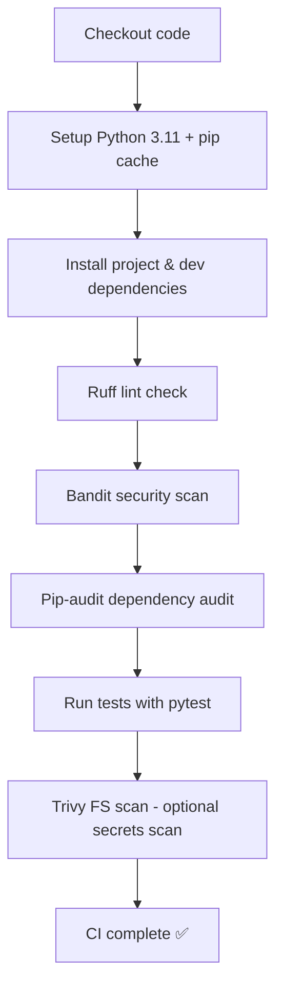

# DevSecOps CI Demo

Minimal Python project with CI pipeline using GitHub Actions. This project demonstrates a minimal but production-oriented CI pipeline with linting, testing and security scanning

## Pipeline

## CI Pipeline для проекта DevSecOps Demo 🚀

Triggered on push and pull requests.

